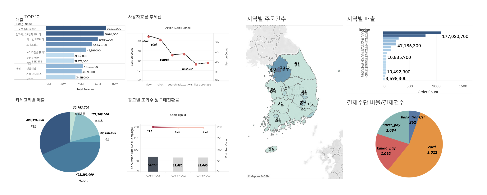
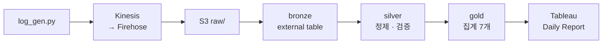
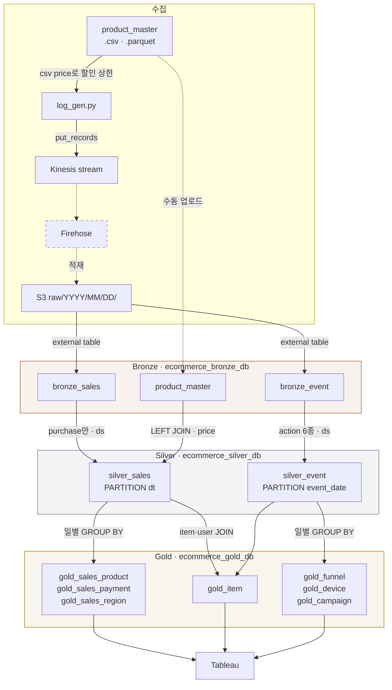
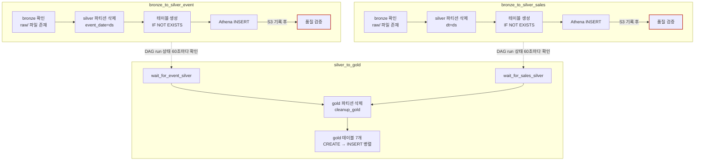

# e-commerce_ETL

> 유저 행동 로그와 판매 데이터를 매일 배치로 처리하는 **Medallion(bronze → silver → gold) 파이프라인**이다.<br>
> S3에 쌓인 로그를 매일 한 번 정제 · 집계해 **Tableau Daily Report**까지 자동으로 이어 준다.



## 한눈에 보기



> **1. Extract** : `log_gen.py` → Kinesis → Firehose → S3 `raw/YYYY/MM/DD/`<br>
> **2. Transform** : bronze(external table) → silver(정제 · 품질 검증) → gold(일별 집계 7개)<br>
> **3. Serving** : Tableau가 Athena로 gold 테이블을 조회 → Tableau Cloud가 Daily Report 발송<br>
> **Orchestration** : Airflow DAG 3개가 매일 15:10(KST)에 전날 데이터를 처리

원본을 S3에 먼저 쌓고 Athena 안에서 변환하므로 구조상 **ELT**다. 적재(`INSERT INTO`)는 Transform 단계 안에서 끝나기 때문에, 마지막 단계는 Load가 아니라 Serving으로 부른다.

## 기술 스택

| 영역 | 사용 |
| --- | --- |
| 수집 | Python(boto3), Amazon Kinesis, Amazon Data Firehose, Amazon S3 |
| 저장 · 변환 | Amazon S3 (Parquet, SNAPPY), Amazon Athena, AWS Glue Data Catalog |
| 오케스트레이션 | Apache Airflow 2.10 (Docker Compose, LocalExecutor) |
| 알림 | Email(SMTP), Slack Webhook |
| BI | Tableau Desktop, Tableau Cloud |

## 디렉토리 구조

```
.
├── LogGen/
│   └── log_gen.py          # 세션 단위 이벤트 생성 → Kinesis 전송
├── dags/
│   ├── event_silver.py     # DAG: bronze_to_silver_event
│   ├── sales_silver.py     # DAG: bronze_to_silver_sales
│   └── silver_to_gold.py   # DAG: silver_to_gold
├── docs/images/            # README 이미지
├── product_master.csv      # 상품 마스터 (item_id, name, category, price)
├── product_master.parquet  # product_master.csv를 Claude로 변환한 Parquet (내용 동일, 코드에서는 읽지 않음)
└── docker-compose.yaml     # Airflow 실행 환경
```

## 데이터 규모

| 항목 | 값 | 근거 |
| --- | --- | --- |
| 생성 속도 | 0.5초마다 세션 1개 ≈ 초당 이벤트 6.4개 (시간당 약 2.3만 행) | 세션당 평균 이벤트 3.2개 (`SESSION_FLOWS` 9종 평균) |
| 구매 비율 | 세션의 22%, 이벤트의 약 7% | 9개 흐름 중 2개가 `purchase`로 끝남 |
| 설계 시 추정 | raw 5만 행 이상, silver 파티션 100KB 이상 | 초기 설계 문서 |

## 1. Extract - 수집

> `log_gen.py` → Kinesis `ecommerce-log-stream` → Firehose `ecommerce-log-firehose` → S3 `raw/YYYY/MM/DD/`<br>
> 이벤트 1건이 JSON 한 줄이고, 행동 로그와 판매 이벤트가 같은 `raw/` 파일에 함께 쌓인다.

**상품 마스터** `product_master.csv`
- 5개 카테고리 × 15개 = 상품 75개 (`item_id`, `name`, `category`, `price`)
- 생성기와 `silver_sales`가 같은 가격표를 쓴다. 생성기는 할인 상한을, silver는 매출을 계산할 때 쓴다.

**로그 생성기** `log_gen.py`
- 0.5초마다 세션 하나 분량의 이벤트를 만들어 `put_records`로 보낸다. 실패하면 지수 백오프로 최대 3번까지 시도하고, 그래도 실패하면 그 배치를 버린다.
- 세션마다 9가지 행동 흐름 중 하나를 따른다. 예 : `search → view → click → add_to_cart → purchase`
- 회원 80%, 비회원 20%. 비회원은 `user_id`가 없고 세션 ID가 `SESS-GUEST-`로 시작한다.
- `quantity`, `discount_amount`, `payment_method`, `region`은 `purchase` 이벤트에만 채워진다.
- 할인은 주문 금액(가격 × 수량)의 30%를 넘지 않는다.

**AWS 설정** (콘솔에서 구성, repo에 없음)
- Kinesis : 온디맨드 용량 모드, 보존 기간 1일. 장기 저장소가 아니라 Firehose로 넘기기 전의 버퍼로 쓴다.
- Firehose : Kinesis → S3 `raw/` 적재, 버퍼 5분.

## 2. Transform - bronze → silver → gold

> **bronze** : 같은 `raw/` 파일을 external table 두 개가 컬럼만 다르게 읽는다. 데이터는 옮기지 않는다.<br>
> **silver** : 처리 날짜(`ds`) 하루치만 골라 정제하고 파생 컬럼을 붙여 Parquet로 쓴 뒤, 품질을 검증한다.<br>
> **gold** : silver를 날짜별로 GROUP BY 해서 Tableau가 바로 쓸 집계 테이블 7개를 만든다.



### bronze : 원본을 두 갈래로 읽기

Glue Data Catalog `ecommerce_bronze_db`에 등록한 external table이다. DDL은 Athena 콘솔에서 직접 작성해 repo에 없다.

| 테이블 | 성격 | 컬럼 |
| --- | --- | --- |
| `bronze_event` | 행동 로그 | event_id, event_timestamp, user_id, session_id, item_id, action, device, platform, referrer, campaign_id, search_keyword, page_type |
| `bronze_sales` | 거래 | event_id, event_timestamp, user_id, region, item_id, quantity, discount_amount, payment_method, action |
| `product_master` | 상품 마스터 | item_id, name, category, price |

### silver : 하루치 정제 · 파생 컬럼 · 품질 검증

| 테이블 | 입력 · 필터 | 추가 · 변경 컬럼 | S3 경로 · 파티션 |
| --- | --- | --- | --- |
| `silver_event` | `bronze_event`, action 6종만 | `event_hour`, `event_dow`, `is_member`(user_id 유무), `is_valid_action`(필터 뒤라 항상 TRUE) | `silver/event/` · `event_date` |
| `silver_sales` | `bronze_sales`, `purchase`만 + `product_master` LEFT JOIN | `order_id`(← event_id), `order_time`(← event_timestamp), `category`, `unit_price`, `total_amount` | `silver/sales/` · `dt` |

`total_amount = unit_price × quantity − discount_amount` (할인은 주문당 1회)

> [!WARNING]
> Athena의 `product_master`에 생성기가 쓰는 `item_id`가 하나라도 빠지면 조인 결과 금액이 NULL이 되고, 아래 검증에서 실패한다.

**품질 검증 규칙**

검증은 그 날짜 silver 파티션의 Parquet 파일을 pandas로 읽어서 한다. 파일이 없거나 비어 있어도 실패로 처리한다.

| 대상 | 검사 항목 |
| --- | --- |
| `silver_event` | `event_id` NULL 없음 · `action`이 view, click, add_to_cart, wishlist, search, purchase 중 하나 · `event_hour`가 0–23 |
| `silver_sales` | `order_id`, `order_time`, `item_id` NULL 없음 · `total_amount ≥ 0` · `unit_price > 0` · `quantity > 0` |

`silver_event`의 action · event_hour 규칙은 INSERT 쿼리가 이미 보장한다. 그래서 실제로 실패할 수 있는 검사는 `event_id` NULL뿐이다. ([알려진 한계](#알려진-한계) 5번)

### gold : 일별 집계 마트 7개

행동 로그와 판매 데이터는 성격이 달라 bronze · silver에서는 따로 처리한다. 전환율과 상품 성과는 둘을 함께 봐야 알 수 있어서, `gold_item`에서만 두 silver 테이블을 조인한다.

| 원천 | 테이블 | 내용 | 파티션 |
| --- | --- | --- | --- |
| silver_event | `gold_funnel` | action별 세션 수 | `event_date` |
| silver_event | `gold_device` | device × action별 이벤트 수 | `event_date` |
| silver_event | `gold_campaign` | 캠페인별 방문 유저 수, 구매 세션 수, 전환율(%) | `event_date` |
| silver_event + silver_sales | `gold_item` | 상품별 조회 · 장바구니 · 구매 세션 수, 전환율(%), 매출 · 평균 주문액(한계 2번) | `event_date` |
| silver_sales | `gold_sales_product` | 상품별 매출, 주문 수, 판매 수량, 평균 주문액 | `order_date` |
| silver_sales | `gold_sales_payment` | 결제수단별 매출, 주문 수, 평균 주문액 | `order_date` |
| silver_sales | `gold_sales_region` | 지역별 매출, 주문 수, 구매 고객 수, 평균 주문액 | `order_date` |

각 테이블은 `gold/` 아래 `gold_`를 뺀 이름의 경로에 Parquet(SNAPPY)로 저장된다. 예 : `gold_sales_region` → `gold/sales_region/`

**지표 정의** : 같은 "전환율"이라도 테이블마다 분모가 다르다.

| 지표 | 정의 |
| --- | --- |
| `gold_campaign.conversion_rate` | 구매가 있는 세션 수 ÷ 그 캠페인으로 들어온 세션 수 × 100 |
| `gold_item.conversion_rate` | 그 상품을 구매한 세션 수 ÷ 그 상품을 조회한 세션 수 × 100 |
| `gold_campaign.visit_user_count` | `COUNT(DISTINCT user_id)` : 비회원은 세지 않는다 |

## 3. Serving - Athena → Tableau

> gold 테이블은 Athena `ecommerce_gold_db`에 등록되어 있고, Tableau가 Athena를 직접 조회한다.<br>
> 데이터량이 작은 일배치라 Redshift 같은 별도 DW 없이 **S3 + Athena를 서빙 레이어**로 쓴다.

| 대시보드 영역 | 사용 테이블 |
| --- | --- |
| 퍼널 · 전환 | `gold_funnel`, `gold_item` |
| 트래픽 · 유입 | `gold_device`, `gold_campaign` |
| 매출 | `gold_sales_product`, `gold_sales_payment`, `gold_sales_region` |

- Tableau Desktop : gold 테이블을 연결해 일별 판매 · 행동 분석 대시보드를 만든다.
- Tableau Cloud : daily 스케줄로 대상자에게 리포트를 발송한다.

## Orchestration - 하루 실행 순서

> 세 DAG 모두 매일 **15:10 (Asia/Seoul)** 에 함께 시작해, 그때까지 도착한 **전날(`ds`) 이벤트**를 처리한다.<br>
> silver DAG 두 개는 나란히 돌고, gold DAG은 sensor로 두 silver DAG이 성공할 때까지 기다린다.



- **스케줄** : cron `10 15 * * *`, `catchup=False`. 15:10을 쓰는 이유는 [설계 결정](#설계-결정) 참고.
- **멱등성** : 쓰기 전에 그 날짜 파티션을 S3에서 지운다. silver는 `cleanup_*` task가, gold는 `cleanup_gold`가 맡는다. 같은 날짜를 다시 실행해도 데이터가 두 번 쌓이지 않는다. 원본 자체의 중복은 제거하지 않는다(한계 4번).
- **gold 진입 조건** : `ExternalTaskSensor`가 60초마다 silver DAG run 상태를 확인한다. `reschedule` 모드, timeout 1시간. silver DAG이 `failed`면 sensor도 바로 실패하고, gold 테이블은 그날 갱신되지 않는다.
- **검증 실패 시** : 검증은 silver 파티션을 S3에 쓴 뒤에 실행된다. 그래서 검증이 실패해도 그 날짜 silver 데이터는 S3와 Athena에 남고, 막히는 쪽은 gold다.
- **알림** : 어떤 task든 실패하면 `alert_all`이 Email과 Slack으로 알린다. 재시도는 하지 않는다(`retries = 0`).

| DAG | task 순서 |
| --- | --- |
| `bronze_to_silver_event` | `check_bronze_data` → `cleanup_silver_partition` → `create_silver_table_if_not_exists` → `insert_silver` → `validate_event_silver` |
| `bronze_to_silver_sales` | `check_bronze_data` → `cleanup_silver_sales_partition` → `create_silver_sales_if_not_exists` → `insert_silver_sales` → `validate_sales_silver` |
| `silver_to_gold` | `wait_for_event_silver`, `wait_for_sales_silver` → `cleanup_gold` → `create_gold_*` (7개) → `insert_gold_*` (7개) |

## 설계 결정

- **수집은 스트림, 처리는 일배치** : 로그는 실제 서비스처럼 이벤트 단위로 Kinesis에 흘려보내고, 최종 소비처인 Daily Report가 일 단위라 변환은 하루 한 번 한다. Kinesis는 온디맨드 모드로 두어 로그량 변동에 맞춰 늘어나게 했다.
- **변환 엔진은 Athena** : 하루 수만 행 규모라 Spark 클러스터 없이 서버리스 SQL로 충분하다. 변환한 결과를 같은 Athena가 서빙까지 맡는다.
- **멱등성은 "파티션 삭제 → INSERT"** : Athena의 일반 테이블은 `INSERT OVERWRITE`가 없다. 그래서 쓰기 전에 그 날짜 S3 경로를 직접 비운다.
- **silver 성공을 gold의 진입 조건으로** : 검증에 실패한 silver 데이터가 gold로 번지지 않도록, gold DAG은 두 silver DAG run이 `success`일 때만 시작한다.
- **15:10(KST) 실행** : Airflow의 `ds`는 logical date를 UTC 기준으로 렌더링한다. KST 09:00 이전에 실행하면 `ds`가 KST 기준 이틀 전 날짜가 되고, 09:00 이후인 15:10에 실행하면 `ds`가 KST 기준 전날과 일치한다.
- **검증은 pandas로 직접** : Great Expectations를 도입했다가 걷어내고, NULL · 범위 검사를 pandas로 구현했다. 아래 트러블슈팅 3번 참고.

## 트러블슈팅

**1. `total_amount`가 음수로 계산됨**
> 원인 : 생성기가 할인액(0–10,000원)을 가격과 상관없이 뽑았다. 3,900원짜리 상품 1개에 10,000원 할인이 붙으면 `total_amount`가 음수가 되고, silver 검증의 `total_amount ≥ 0` 규칙에 걸린다.<br>
> 해결 : 생성기가 `product_master.csv` 가격을 읽어, 할인을 주문 금액의 30% 이하로 제한한다.

**2. 처리 날짜가 하루씩 어긋남**
> 원인 : `ds`는 이미 직전 구간(전날)을 가리키는데 `macros.ds_add(ds, -1)`로 하루를 더 빼고 있었다. 게다가 실행 시각이 00:10 · 00:25(KST)라, UTC로 렌더링되는 `ds` 자체도 KST 전날보다 하루 이르게 나왔다.<br>
> 해결 : `target_dt`를 `{{ ds }}`로 바꾸고, 실행 시각을 KST 09:00 이후인 15:10으로 옮겼다.

**3. Great Expectations 도입 후 제거**
> 원인 : `ge.from_pandas` → `great_expectations.dataset.PandasDataset` 순서로 시도했지만, 둘 다 GX 1.0에서 제거된 레거시 API다. 패키지 버전을 고정하지 않아서, 최신 GX가 설치되면 두 방식 모두 쓸 수 없다.<br>
> 해결 : GE를 의존성에서 빼고, 같은 규칙(NULL · 범위 검사)을 pandas로 직접 구현했다.

## 알려진 한계

1. **세션 지표가 과대 집계됨** : 회원 세션 ID는 사용자당 5개로 고정(총 500개)이라, 같은 ID가 하루에도 여러 번 재사용된다. 하루에 5만 행이 쌓이면 ID 하나가 약 25번 쓰여, 회원 세션은 거의 모두 "구매가 있는 세션"이 된다. 생성기 기준 구매 흐름 비율은 22%인데, 대시보드의 캠페인 전환율이 61.6~64.2%로 나오는 것도 이 때문이다. `gold_funnel`, `gold_campaign`, `gold_item`의 세션 수 · 전환율은 실제 행동 지표로 읽을 수 없다.<br>
   개선 방향 : 방문마다 새 UUID를 세션 ID로 발급한다.
2. **`gold_item`의 매출 · 평균 주문액이 부정확함** : `silver_sales`를 날짜 조건 없이 `item_id` · `user_id`로 조인한다. 그래서 다른 날의 구매까지 더해지고, 같은 날 같은 상품을 여러 번 산 경우 행이 곱해지며, `user_id`가 없는 비회원 구매는 빠진다. 상품별 매출은 `gold_sales_product`를 기준으로 본다.<br>
   개선 방향 : `bronze_sales` · `silver_sales`에 `session_id`를 추가하고, 날짜와 세션 기준으로 조인한다.
3. **늦게 도착한 이벤트는 처리되지 않음** : 생성기는 세션 시작 시각을 최대 24시간 전으로 잡는다. 그래서 D일 이벤트가 D+1일 자정까지 계속 들어오는데, D+1일 15:10 실행 이후 도착분은 다시 처리되지 않는다(`catchup=False`).<br>
   개선 방향 : 이벤트 시각을 전송 시각 근처로 생성하거나, 최근 며칠을 다시 처리한다.
4. **중복 제거 없음** : `put_records`가 일부만 실패해도 배치 전체를 다시 보낸다. Firehose도 같은 레코드를 두 번 이상 전달할 수 있다(at-least-once). silver는 `event_id` 중복을 제거하지 않고, 검증도 중복을 보지 않는다.<br>
   개선 방향 : silver INSERT에서 `event_id` 기준으로 중복을 제거하고, 검증에 중복 검사를 추가한다.
5. **검증 범위가 좁음** : `silver_event`는 사실상 `event_id` NULL만 검사한다. 행 수 기준 검사가 없고, 검증이 쓰기 뒤에 실행되어 실패한 데이터도 silver에 남는다.<br>
   개선 방향 : 행 수 · 중복 검사를 추가하고, 임시 경로에 쓴 뒤 검증을 통과하면 공개한다(Write-Audit-Publish).
6. **bronze 확인이 도착 날짜 기준임** : `check_bronze_data`는 `raw/{ds}/`에 파일이 있는지만 본다. 이 경로는 Firehose가 UTC 도착 시각으로 만든 것이라, 처리 대상인 이벤트 날짜(`ds`)의 데이터가 있는지와는 다르다.

## 실행

### 1) 사전 준비 : repo 밖 AWS 리소스

| 리소스 | 내용 |
| --- | --- |
| S3 버킷 | 버킷 이름이 DAG 3개 상단 상수(`BUCKET`, `SILVER_S3_PATH` / `GOLD_S3_PATH`, `ATHENA_RESULTS`)에 하드코딩되어 있다. 자기 버킷으로 바꾼다. |
| Kinesis · Firehose | 스트림 1개와, 스트림 → S3 `raw/`로 보내는 Firehose |
| Athena 데이터베이스 | `ecommerce_bronze_db`, `ecommerce_silver_db`, `ecommerce_gold_db`. silver · gold 테이블은 DAG이 만들지만 데이터베이스는 미리 있어야 한다. |
| bronze 테이블 | `bronze_event`, `bronze_sales` : `raw/`의 JSON을 읽는 external table (컬럼은 위 bronze 표 참고) |
| `product_master` | `ecommerce_bronze_db`에 `product_master.csv` 내용을 적재한 테이블 |
| Tableau | 워크북과 Tableau Cloud 발송 스케줄 |

### 2) Airflow

repo 루트에 `.env`를 만든다.

```
AIRFLOW_UID=501            # macOS/Linux: id -u 결과
SMTP_USER=...              # 알림 메일 발신·수신 계정 (Gmail)
SMTP_PASSWORD=...          # Gmail 앱 비밀번호 (계정 비밀번호 아님)
SLACK_WEBHOOK_URL=...
```

```bash
docker compose up -d
```

- 컨테이너가 뜰 때마다 `_PIP_ADDITIONAL_REQUIREMENTS`의 패키지를 설치하므로, 처음 뜨기까지 시간이 걸린다.
- UI: http://localhost:8080 (기본 계정 `airflow` / `airflow`)
- DAG은 일시정지 상태로 생성되므로 UI에서 세 DAG을 켠다.
- Admin → Connections에 AWS 연결을 추가한다.
  - Conn Id: `aws_default`
  - Conn Type: Amazon Web Services
  - Login / Password: ACCESS_KEY / SECRET_KEY
  - Extra: `{"region_name": "ap-northeast-1"}`

### 3) 로그 생성기

`.env`에 다음 값을 추가한다.

```
KINESIS_STREAM_NAME=...
REGION=ap-northeast-1
ACCESS_KEY=...
SECRET_KEY=...
```

```bash
pip install boto3 python-dotenv
python LogGen/log_gen.py
```

0.5초마다 세션 하나 분량의 이벤트를 Kinesis로 보낸다. 멈출 때는 Ctrl+C.

### 4) 특정 날짜 처리

`catchup=False`라 지난 날짜는 자동으로 돌지 않는다. 특정 날짜를 처리하려면 세 DAG을 **같은 logical date**로 직접 실행한다.

```bash
# ds=2026-09-28 처리. logical date는 UTC로 준다.
for dag in bronze_to_silver_event bronze_to_silver_sales silver_to_gold; do
  docker compose exec airflow-scheduler airflow dags trigger "$dag" -e 2026-09-28T06:10:00+00:00
done
```

- gold의 sensor는 자기와 같은 logical date의 silver run을 찾는다. 세 DAG에 같은 값을 줘야 한다.
- 그 날짜 이벤트가 `raw/`에 있어야 하고, DAG이 켜져 있어야 실행된다.
